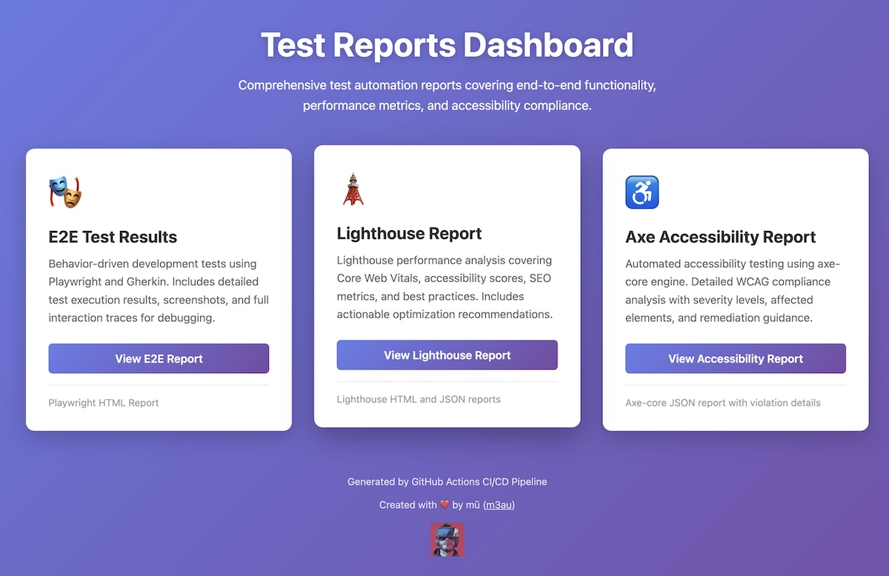

# 🤖 Playwright Pilot

**AI-Piloted E2E Testing with Playwright & BDD**

[](https://github.com/m3au/playwright-pilot/actions/workflows/ci.yml)
[](tests/unit/)
[](https://github.com/features/actions)
[](https://conventionalcommits.org)
[](https://nodejs.org/)
[](https://bun.sh/)
[](https://www.typescriptlang.org/)
[](https://playwright.dev/)
[](https://github.com/vitalets/playwright-bdd)
[](https://cucumber.io/docs/gherkin/)
[](https://github.com/dequelabs/axe-core)
[](https://developer.chrome.com/docs/lighthouse/)
[](https://eslint.org/)
[](https://typescript-eslint.io/)
[](https://github.com/SonarSource/eslint-plugin-sonarjs)
[](https://github.com/sindresorhus/eslint-plugin-unicorn)
[](https://prettier.io/)
[](https://cspell.org/)
[](https://github.com/DavidAnson/markdownlint)
[](https://typicode.github.io/husky/)
[](https://github.com/lint-staged/lint-staged)
[](https://editorconfig.org/)
[](https://nodejs.org/api/esm.html)
[](https://github.com/dependabot)
[](https://pages.github.com/)
[](LICENSE)


## Table of Contents <!-- omit from toc -->

- [🤖 Playwright Pilot](#-playwright-pilot)
  - [About](#about)
  - [Test Reports](#test-reports)
  - [Documentation](#documentation)
  - [Project Structure](#project-structure)
  - [Quick Setup](#quick-setup)
  - [Architecture \& Patterns](#architecture--patterns)
  - [AI Assistance](#ai-assistance)
  - [Code Quality](#code-quality)

---

## About

This project implements a complete Playwright E2E test automation framework with:

- **AI-Assisted Development**: Optimized for **Cursor IDE** with custom rules to enforce project conventions
- **Behavior-Driven Development (BDD)**: Utilizes Gherkin and `playwright-bdd` for clear, collaborative feature development
- **Decorated Page Object Model (POM)**: Eliminates separate step files by using **TypeScript decorators** (`@Given`, `@When`, `@Then`) directly on POM methods
- **TypeScript**: Full type safety with strict mode enabled
- **High-Speed Runtime**: Leverages **Bun** as both package manager and runtime for blazing-fast execution
- **Accessibility Testing**: Axe-core integration for automated WCAG compliance audits
- **Performance Testing**: Lighthouse integration for Core Web Vitals and performance audits
- **Interactive HTML Reports**: Automatically published to a dedicated **GitHub Pages dashboard** (including traces and media)
- **Code Quality**: ESLint, Prettier, CSpell, Husky hooks, and Conventional Commits enforcement
- **Environment Configuration**: Multi-environment support (development, staging, production) via .env files
- **CI/CD**: GitHub Actions workflows with automated test execution and report publishing
- **Dependabot**: Automated dependency updates with strict version pinning
- **Local Testing**: Act integration for testing GitHub Actions workflows locally before pushing

---

## Test Reports



Check 👉🏼 [GitHub Pages HTML Report](https://m3au.github.io/tech-challenge/) for the _**Interactive HTML reports**_ generated automatically from Playwright test runs, including test results, traces, screenshots, and accessibility/performance audit reports.

View workflow runs 👉🏼 [GitHub Actions](https://github.com/m3au/playwright-pilot/actions), we're running 30 tests using 2 shards (WORKERS=100% per shard).

---

## Documentation

Comprehensive documentation covering architecture, development workflows, code quality tools, AI assistance configuration, and project goals. All documentation is located in the `docs/` directory.

- **[Architecture Documentation](./docs/architecture.md)** - System architecture, design decisions, and diagrams
- **[Development Guide](./docs/development.md)** - Development setup, guidelines, and best practices
- **[Code Quality Files](./docs/code-quality.md)** - Reference guide for all code quality configuration files
- **[AI Tuning](./docs/ai-tuning.md)** - Cursor IDE rules and AI assistant configuration
- **[Act Testing](./docs/act-testing.md)** - Local GitHub Actions workflow testing with act
- **[Changelog](./CHANGELOG.md)** - Complete version history and release notes

---

## Project Structure

A high-level view of the project's directory structure:

```text
playwright-pilot/
├── .cursor/                   # Cursor IDE configuration
│   ├── mcp.json               # MCP servers (Playwright, GitHub)
│   ├── hooks/                 # Example hook scripts (copy to ~/.cursor/hooks/ to use)
│   └── rules/                 # Cursor rules (commits, comments, testing, etc.)
├── **.github/**               # GitHub configuration
│   ├── **workflows/**         # CI/CD workflows (GitHub Actions)
│   │   ├── ci.yml             # Main CI orchestrator workflow + report publishing
│   │   ├── unit-tests.yml     # Unit tests workflow
│   │   ├── test.yml           # E2E tests workflow
│   │   ├── lighthouse.yml     # Lighthouse audit workflow
│   │   ├── axe.yml            # Axe audit workflow
│   │   └── dependabot.yml     # Dependabot workflow (pins versions on PRs)
│   ├── dependabot.yml         # Dependabot configuration (dependency updates)
│   └── templates/             # Report templates (HTML)
├── .husky/                    # Git hooks (pre-commit, commit-msg, prepare-commit-msg, pre-push)
├── **tests/**                 # All test suites
│   ├── **e2e/**               # End-to-end tests
│   │   ├── data/              # Data layer (environment configs)
│   │   ├── **features/**      # Gherkin feature files
│   │   ├── **poms/**          # Page Object Models with decorators
│   │   │   ├── components/    # Reusable component POMs
│   │   │   └── pages/         # Page POMs
│   │   └── **world.ts**       # Playwright fixtures and test setup
│   ├── utils/                 # Shared utility functions
│   ├── unit/                  # Unit tests (100% coverage)
│   └── audit/                 # Audit tests (axe, lighthouse)
├── **scripts/**               # Utility scripts
│   ├── bump-version.mjs       # Automatic version bumping
│   ├── pin-versions.mjs       # Dependency version pinning
│   ├── changelog.mjs          # Changelog generation
│   └── lint.mjs               # Unified linting: TypeScript → ESLint → ShellCheck
├── docs/                      # Documentation
├── Makefile                   # Make targets for local workflow testing
├── package.json               # Dependencies and scripts
├── bun.lock                   # Bun lock file (pinned dependency versions)
├── bunfig.toml                # Bun package manager configuration
├── playwright.config.ts       # Playwright E2E configuration
├── eslint.config.mjs          # ESLint configuration
├── prettier.config.mjs        # Prettier configuration
├── tsconfig.json              # TypeScript configuration
├── main.code-workspace        # VS Code workspace configuration
├── .cspell.jsonc              # Spell checker configuration
├── .markdownlint.jsonc        # Markdown linting configuration
├── .lintstagedrc.json         # lint-staged configuration
├── .prettierignore            # Prettier ignore patterns
├── .editorconfig              # Editor configuration (indentation, encoding)
├── .gitignore                 # Git ignore patterns
├── .gitattributes             # Git attributes (line endings, file types)
├── .cursorignore              # Cursor IDE ignore patterns
├── .nvmrc                     # Node version manager version
├── .npmrc                     # npm configuration
├── .env                       # Environment variables (local, gitignored)
├── .env.example               # Environment variables template
├── .env.production            # Production environment variables template
├── LICENSE                    # License file
└── README.md                  # This file
```

---

## Quick Setup

**Install:**

```shell
bun install
```

**Configure:**

```shell
# Copy .env.example to .env and customize the configuration
cp .env.example .env
```

Environment-specific templates ([`.env.production`](.env.production)) are also available for different deployment environments.

See [Development Guide](./docs/development.md#environment-configuration) for complete environment variable documentation and CI vs local configuration differences.

**Run:**

```shell
bun run          # List all available project commands
bun run test     # Run E2E tests (includes pretest step)
bun test         # Run unit tests with coverage enabled
bun pretest      # Generate BDD step files from Gherkin features
bun ui           # Run tests with Playwright UI
bun headed       # Run E2E tests in visible browser mode
bun debug        # Run E2E tests with Playwright's interactive debugger
bun failed       # Run only failed tests from previous run
bun axe          # Run accessibility tests
bun lighthouse   # Run Lighthouse performance tests
```

**Code Quality:**

```shell
bun lint              # Run all linting: TypeScript → ESLint → ShellCheck
bun lint:fix          # Fix ESLint errors (TS, MJS, JSON, HTML, Markdown, YAML)
bun lint:typescript   # TypeScript type checking only
bun lint:eslint       # ESLint only (TS, MJS, JSON, HTML, Markdown, YAML, .mdc)
bun lint:markdown     # Markdown linting only
bun lint:shellcheck   # ShellCheck only (Husky git hooks)
```

**Local CI/CD Testing:**

Test GitHub Actions workflows locally using the Makefile (requires Docker and act):

```shell
make test        # Test E2E tests workflow locally
make lighthouse  # Test Lighthouse audit workflow locally
make axe         # Test Axe audit workflow locally
make ci          # Test main CI workflow locally
make help        # Show all available workflow test targets
```

## Architecture & Patterns

**Page Object Model (POM):** Located in `tests/e2e/poms/`. This framework eliminates separate step definition files by applying **BDD decorators** (`@Given`, `@When`, `@Then`) directly to the Page Object methods. POMs are automatically registered as fixtures using the `@Fixture` decorator.

**World:** Custom Fixture (`tests/e2e/world.ts`) is the central hub. It extends the standard `playwright-bdd` test, registers all POMs (CableConfiguratorPage, CableSelectorPopup, CookieBanner, ProductDetailPage) using the custom `@Fixture` decorator, provides a world fixture containing the Playwright page and environment data, and exports the core BDD decorators (`@Fixture`, `@Given`, `@When`, `@Then`) and Playwright types (`expect`, `Locator`, `Page`). The custom `@Step` decorator for internal step definitions is defined in `tests/utils/decorators.ts` and re-exported from `@world`.

**Data Layer:** `tests/e2e/data/config.ts` loads environment-specific data for test execution.

**BDD with Gherkin:** Feature files are located in `tests/e2e/features/`. Test files are automatically generated to `test-output/bdd-gen/`.

## AI Assistance

This project is configured for AI-assisted development with Cursor IDE. Rules guide AI assistants to follow project conventions and maintain code quality.

**Configuration:**

- Rules automatically apply when editing files (context-aware based on file patterns)
- Use `@browser` for browser automation, `@playwright` for Playwright test features
- Configuration files: `.cursor/rules/` (rules), `.cursor/mcp.json` (MCP servers), `.cursorignore` (context exclusion)

---

## Code Quality

This project uses comprehensive code quality tooling:

- **ESLint** (`eslint.config.mjs`) - Linting with TypeScript, SonarJS, Unicorn, CSpell, Playwright, JSON, HTML, YAML, and Markdown support
- **ShellCheck** - Shell script linting for Husky git hooks
- **Prettier** (`prettier.config.mjs`) - Code formatting
- **TypeScript** (`tsconfig.json`) - Type checking with strict mode
- **CSpell** (`.cspell.jsonc`) - Spell checking (English, German, TypeScript)
- **EditorConfig** (`.editorconfig`) - Editor configuration for consistent formatting
- **Git Attributes** (`.gitattributes`) - Consistent line endings and file handling
- **Husky** (`.husky/`) - Git hooks (pre-commit, commit-msg, pre-push, prepare-commit-msg)
- **lint-staged** (`.lintstagedrc.json`) - Staged file linting
- **Conventional Commits** - Commit message format validation

**Git Hook Actions:**

- **Pre-commit**: Runs **Unit Tests**, then executes **lint-staged** (ESLint, Prettier, ShellCheck) on only the staged files for speed
- **Commit-msg**: Validates conventional commit format
- **Prepare-commit-msg**: Automatically calculates the next **Semantic Version** and updates the `CHANGELOG.md` based on your commit message
- **Pre-push**: TypeScript type checking
- **CI/CD**: Runs all quality gates automatically (unit tests run first, before other tests)

**Editor Integration:**

- **Format on Save**: Enabled via VS Code workspace settings (Prettier for all files)
- **ESLint**: Auto-fix on save enabled (TS, JS, Markdown via @eslint/markdown)
- **TypeScript**: Real-time type checking
- **CSpell**: Spell checking integrated into ESLint
- **EditorConfig**: Consistent formatting across editors

**Automatic Versioning:**

Version bumping and changelog generation happen automatically on commit:

- `feat:` commits → Minor version bump + changelog entry
- `fix:` commits → Patch version bump + changelog entry
- `perf:` commits → Patch version bump + changelog entry (performance improvements)
- `refactor:` commits → Patch version bump + changelog entry (code refactoring)
- `BREAKING CHANGE` → Major version bump + changelog entry
- Other commit types (`docs:`, `style:`, `test:`, `chore:`, `ci:`, `build:`) → No version bump

See [CHANGELOG.md](./CHANGELOG.md) for complete version history.

---

Created with ❤️ by mū ([m3au](https://github.com/m3au))


